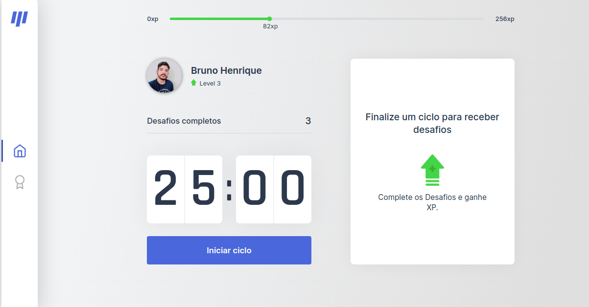
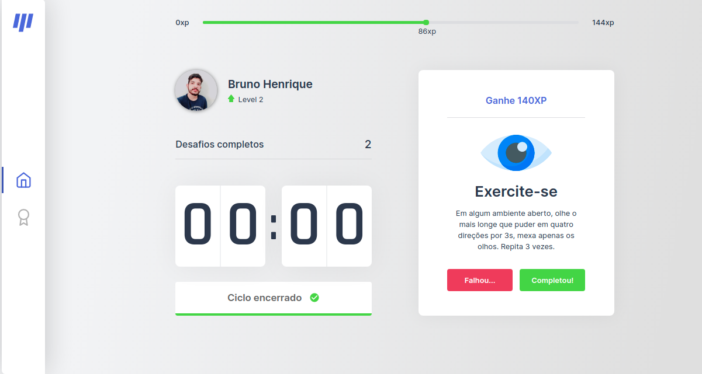
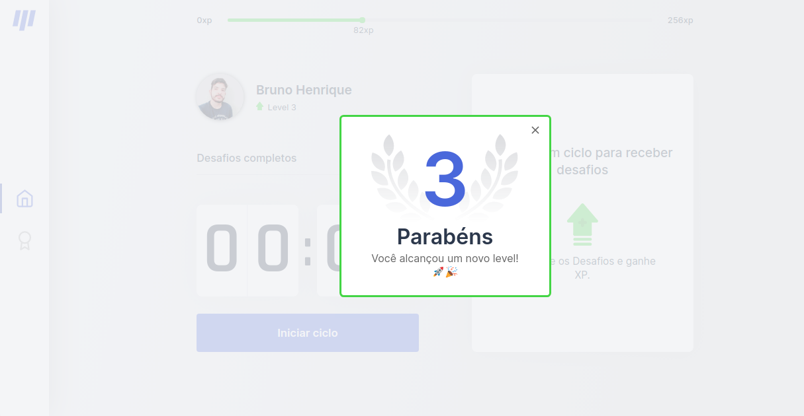
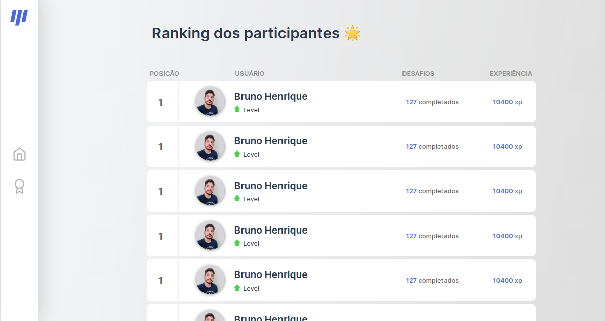

<div align="center">


## Move-it Nlw 04

<p>
  
  
  

  

  <a href="https://opensource.org/licenses/MIT">
    
  </a>

  <a href="https://github.com/martins-rafael/moveIt/commits/master">
    
  </a>
</p>
</div>

<div align="center">
  <sub>
    The NLW #4 project. Built with ❤︎ by
    <a href="https://github.com/Brunoinx">Bruno Henrique</a> 
  </sub>
</div>
<br>

### Status do Projeto
> :warning: Status do Projeto: Em desenvolvimento de novas features

<br>

## :pushpin: Conteúdo 

- [Descrição](#Descrição)
- [Tecnologias utilizadas](#tecnologias)
- [Instalação e uso](#instalação-e-uso)
- [Licença](#licença)

<br>

## :book: Descrição
O Workout é um App baseado na técnica de [pomodoro](https://pt.wikipedia.org/wiki/T%C3%A9cnica_pomodoro), com o objetivo de melhorar sua produtividade e foco. Desenvolvido durante a Next Level Week #4 da [Rocketseat](https://rocketseat.com.br/).

<br>

## :computer: Layouts

<div style="display: flex;">
  <h5 align="left" style="margin-right: 20px"> 📥 Layout disponivel para download em: </h5>

  <p style="margin-top: 10px">
    <a title="Figma" target="_blank" href="https://www.figma.com/file/1h1eTWaALoh8yx5IqU7Nnp/Workout-(Move.it)?node-id=0%3A1">
      
    </a>
  </p>
</div>

<br>

<p style="display: grid; grid-template-columns: 1fr 1fr; gap: 50px">
  
  
  
  
</p>
<br>

## :robot: Tecnologias
Tecnologias e ferramentas utilizadas no desenvolvimento do projeto:

- [Next.js](https://nextjs.org/)
- [React](https://reactjs.org/)
- [TypeScript](https://www.typescriptlang.org/)
- [CSS3](https://developer.mozilla.org/pt-BR/docs/Web/CSS)

<br>

## :package: Instalação e uso

```bash
# Abra um terminal e copie este repositório com o comando
git clone https://github.com/brunoinx/workout-nlw04.git

# Entre na pasta web com 
cd workout-next

# Instale as dependências
npm install ou yarn install (ou somente yarn)

# Rode o aplicação
npm run dev ou yarn dev

```
<h5>Acesse as pages no seu navegador: </h5>
  <p>- Página de login: http://localhost:3000</p>
  <p>- Página inicial: http://localhost:3000/home</p>
  <p>- Página de rankings dos perfis: http://localhost:3000/ranking</p>

<br>

## :pencil: Licença
<a href="https://opensource.org/licenses/MIT">
    
</a>

<br>

Esse projeto está sob a licença MIT. Veja o arquivo [LICENSE](/LICENSE) para mais detalhes.

---

Feito com :purple_heart: by [Bruno Henrique](https://github.com/brunoinx)

[](https://www.linkedin.com/in/bruno-henrique10/) 
[](brunoh.henriqueh01@gmail.com)